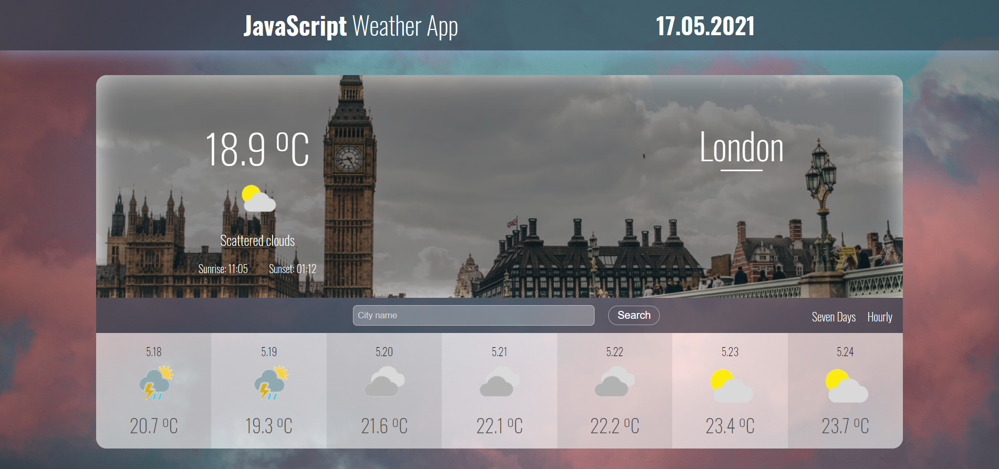
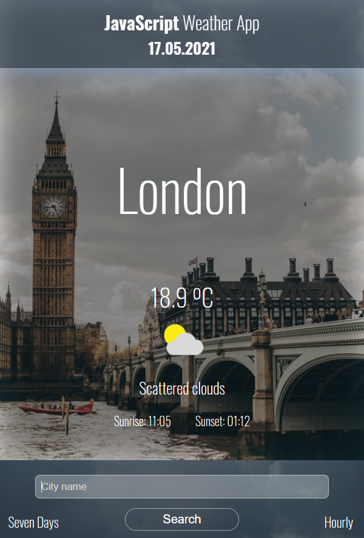

# Read Me Template




> This is a ReadMe template to help save you time and effort.

---

### Table of Contents
You're sections headers will be used to reference location of destination.

- [Description](#description)
- [How To Use](#how-to-use)
- [References](#references)
- [License](#license)
- [Author Info](#author-info)

---

## Description


#### Technologies

- HTML5
- CSS3
- JavaScript
- API


[Back To The Top](#read-me-template)

---

## How To Use


#### API Reference

```html
    <p>dummy code</p>
```
[Back To The Top](#read-me-template)

---

## References
[Back To The Top](#read-me-template)

---


[Back To The Top](#read-me-template)

---

## Author Info

- LinkedIn - [@Kacper Barabasz](https://www.linkedin.com/in/kacper-barabasz/)

[Back To The Top](#read-me-template)

